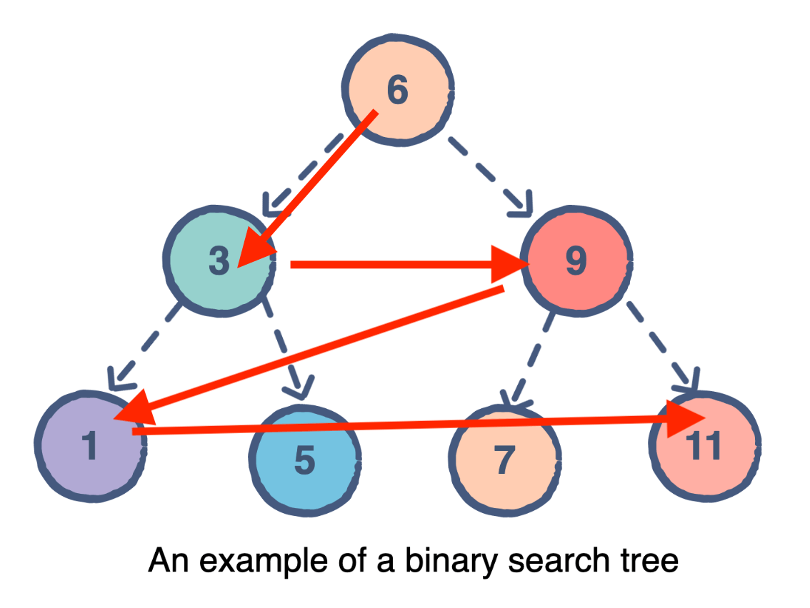

# Binary Tree to Array

Given a binary tree in object, return nodes from top to bottom like below.

Time: 15 mins



## Example 1

```
//   1
// 2   4
//  3 5

const input = {
  value: 1,
  left: {
    value: 2,
    left: null,
    right: { value: 3, left: null, right: null },
  },
  right: {
    value: 4,
    left: { value: 5, left: null, right: null },
    right: null,
  },
};

const expected_output = [1, 2, 4, 3, 5];
```

## Example 2

```
//     6
//  3    9
// 1 5  7 11

const input2 = {
  value: 6,
  left: {
    value: 3,
    left: { value: 1, left: null, right: null },
    right: { value: 5, left: null, right: null },
  },
  right: {
    value: 9,
    left: { value: 7, left: null, right: null },
    right: { value: 11, left: null, right: null },
  },
};

const expected_output = [6, 3, 9, 1, 5, 7, 11];
```

## Why i failed

Was trying hard to do the sorting in the recursion, turns out it will be much easier to sort the array afterwards. (Complexity is bad this way though, but guess it's better than fail)
